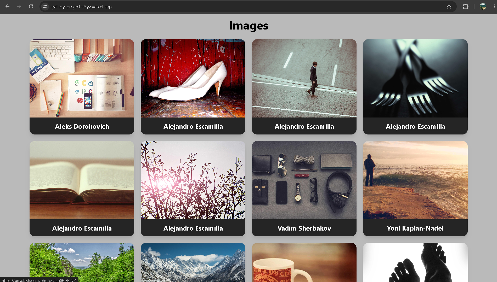

# 🖼️ Image Gallery

🔗 [Live Demo](https://gallery-project-r3yz.vercel.app/)

---

## What It Does
A responsive image gallery built with React that displays photos from
Lorem Picsum with pagination support. Click any image to view the full
photo on Unsplash.

---

## Preview


---

## Features
- 🗂️ Responsive image grid layout
- 📄 Pagination — navigate through pages of images
- ⏳ Loading state while fetching new images
- 🏷️ Photographer name overlay on each card
- 🔗 Click to open full image source

---

## Tech Used
- React · Vite · CSS · Lorem Picsum api

---

## What I Learned
- Fetching and rendering paginated image data in React
- Managing loading and data states with useState and useEffect
- Building responsive grid layouts
- Handling async operations cleanly in React components

---

## How to Run Locally
```bash
git clone https://github.com/jayant-ssharma/gallery-project.git
cd gallery-project
npm install
npm run dev
```